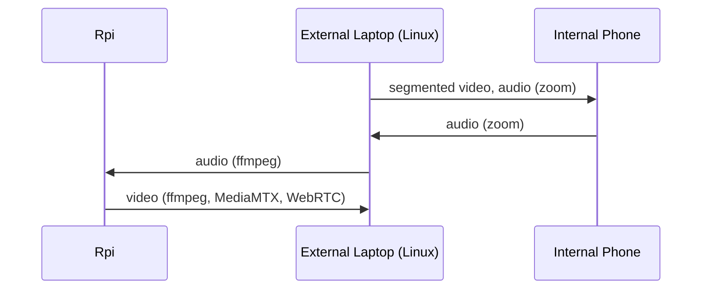

# MERIDIAN
Monorepo for all relevant MERIDIAN source code. 

## Install
See installation steps in `MERIDIAN-infra`'s `README.md`
```bash
cd MERIDIAN-infra
docker compose up -d
```
For external device's WebRTC web server: 
```bash
cd MERIDIAN-web
pnpm install
pnpm dev
```

To run the MERIDIAN voice detection + tracking:

```bash
# Setup
python3 -m venv venv
source venv/bin/activate
pip install -r requirements.txt

# Run
python3 main.py --video-source /dev/video0 --show

## If you have a file (audio and video can be seperate)
python3 main.py --video-source my-video.mp4 --audio-source my-video.mp4 --show

# "meridian wake", "meridian sleep"
# Press 'q' to quit video window
```

## Service Architecture

