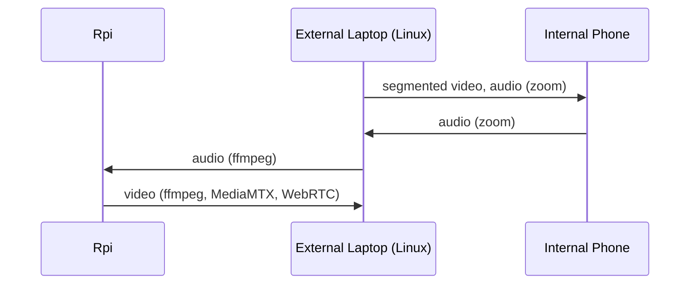

# MERIDIAN
Monorepo for all relevant MERIDIAN source code. 

## Install
### External Device
Broadcast audio to rtp for Rasberry PI.
```bash
cd MERIDIAN-infra/external-device    
PI_IP=0.0.0.0 PORT=5004 MONITOR=$(./select-audio-monitor.sh) ./rtp-audio-broadcaster.sh # insert actual PI_IP here
```
  
### Raspberry PI
### WebRTC Setup
Setup MediaMTX WebRTC server to get PI cam UDP -> WebRTC:
```bash
cd MERIDIAN-infra/rpi
docker compose up -d
```
Set up WebRTC web client: 
```bash
cd MERIDIAN-web
pnpm install
pnpm dev
```
### Voice Detection and Tracking Setup 
Setup rtp listener for MERIDIAN voice detection + tracking. For more details, see `MERIDIAN-infra`'s `README.md`.
```bash
# install deps
python3 -m venv venv
source venv/bin/activate
pip install -r requirements.txt

# setup rtp listener and  MERIDIAN voice detection + tracking
cd MERIDIAN-infra/rpi
mkfifo /tmp/audio_pipe.pcm
PORT=5004 OUT=/tmp/audio_pipe.pcm AR=16000 CHANNELS=1 MODE=pcm ./rtp-audio-listener.sh && python3 ../../main.py --video-source /dev/video0 --audio-source /tmp/audio_pipe.pcm --show
```

#### Testing
To run the MERIDIAN voice detection + tracking:

```bash
# Setup
python3 -m venv venv
source venv/bin/activate
pip install -r requirements.txt

# Run
python3 main.py --video-source /dev/video0 --show

## If you have a file (audio and video can be seperate)
python3 main.py --video-source my-video.mp4 --audio-source my-video.mp4 --show

# "meridian wake", "meridian sleep"
# Press 'q' to quit video window
```

## Service Architecture

