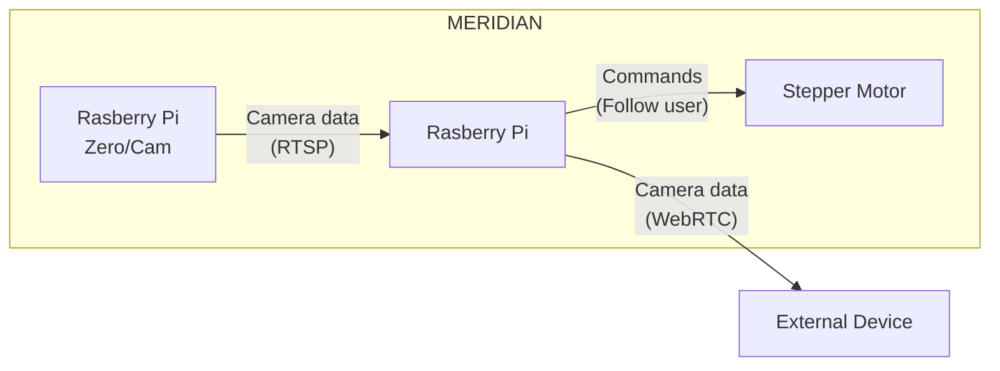
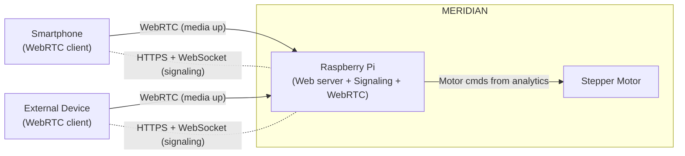
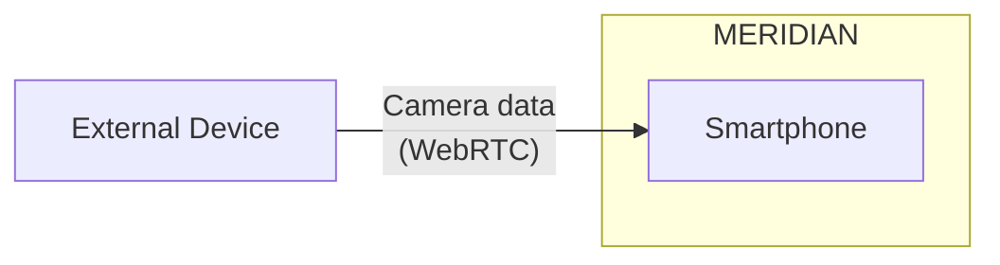

# MERIDIAN
Monorepo for all relevant MERIDIAN source code. 

## Network Architecture
### Case 1: MERIDIAN broadcasts video

```mermaid
graph LR
    subgraph MERIDIAN
    rpi0["Rasberry Pi<br/>Zero/Cam"] -- "Camera data<br/>(RTSP)" --> rpi["Rasberry Pi"] 
    rpi -- "Commands<br/>(Follow user)" --> sm["Stepper Motor"]
    end
    rpi -- "Camera data<br/>(WebRTC)" --> m["External Device"]
```

```mermaid
graph LR
  subgraph MERIDIAN
    rpi["Raspberry Pi<br/>(Web server + Signaling + WebRTC)"]
    motor["Stepper Motor"]
  end

  phone["Smartphone<br/>(WebRTC client)"]
  ext["External Device<br/>(WebRTC client)"]

  %% Client publishes to Pi
  phone -- "WebRTC (media up)" --> rpi
  ext -- "WebRTC (media up)" --> rpi

  %% Signaling
  phone -. "HTTPS + WebSocket (signaling)" .- rpi
  ext -. "HTTPS + WebSocket (signaling)" .- rpi

  rpi -- "Motor cmds from analytics" --> motor
```

### Case 2: MERIDIAN receives video

```mermaid
graph LR
    bm["External Device"]

    subgraph MERIDIAN
        rm["Smartphone"]
    end

    bm -- "Camera data<br/>(WebRTC)" --> rm
```