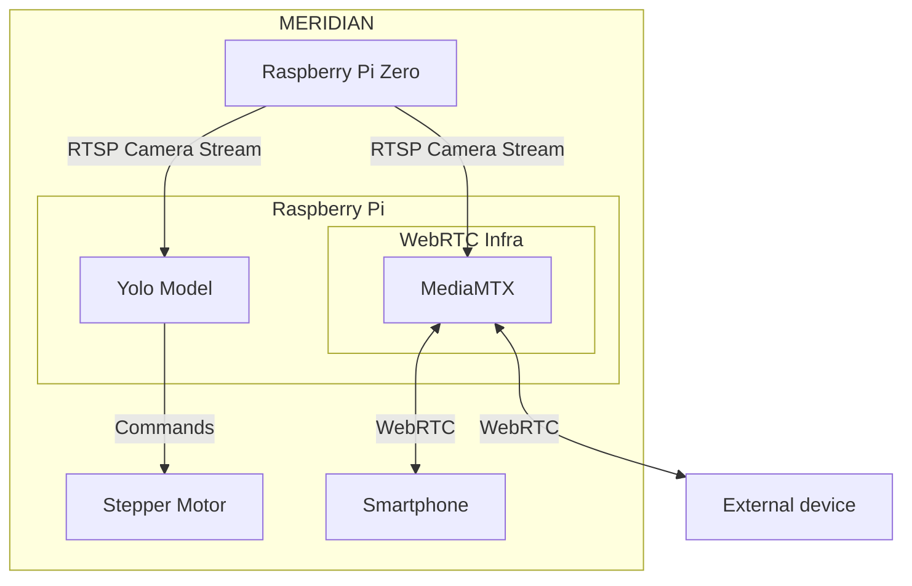

# MERIDIAN
Monorepo for all relevant MERIDIAN source code. 

## Install

```bash
cd MERIDIAN-infra
docker compose up -d
```

```bash
cd MERIDIAN-web
pnpm install
pnpm dev
```

## Service Architecture

