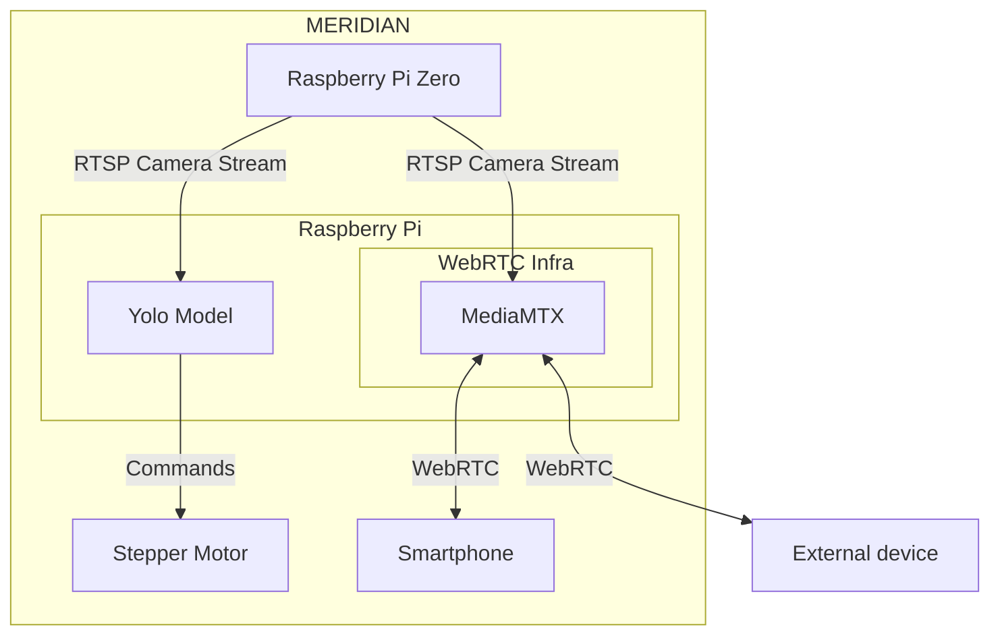

# MERIDIAN
Monorepo for all relevant MERIDIAN source code. 

## Install

```bash
cd MERIDIAN-infra
docker compose up -d
```

```bash
cd MERIDIAN-web
pnpm install
pnpm dev
```

For testing, stream from your webcam with:
```bash
ffmpeg -f v4l2 -input_format mjpeg -framerate 30 -video_size 1280x720 -i /dev/video0 -c:v libx264 -preset veryfast -tune zerolatency -pix_fmt yuv420p -g 60 -f rtsp -rtsp_transport tcp rtsp://127.0.0.1:8554/meridian_cam
```

## Service Architecture


```mermaid
flowchart TD
subgraph MERIDIAN
    subgraph Raspberry Pi
        subgraph WebRTC Infra 
            MM["MediaMTX"]
        end
        ym["Yolo Model"]
    end
    rpi0["Raspberry Pi Zero"]
    m["Stepper Motor"]
    sm["Smartphone"]
end
ed["External device"]

ym -- "Commands" --> m
rpi0 -- "RTSP Camera Stream" --> ym
rpi0 -- "RTSP Camera Stream" --> MM
MM <-- "WebRTC" --> ed
MM <-- "WebRTC" --> sm
```