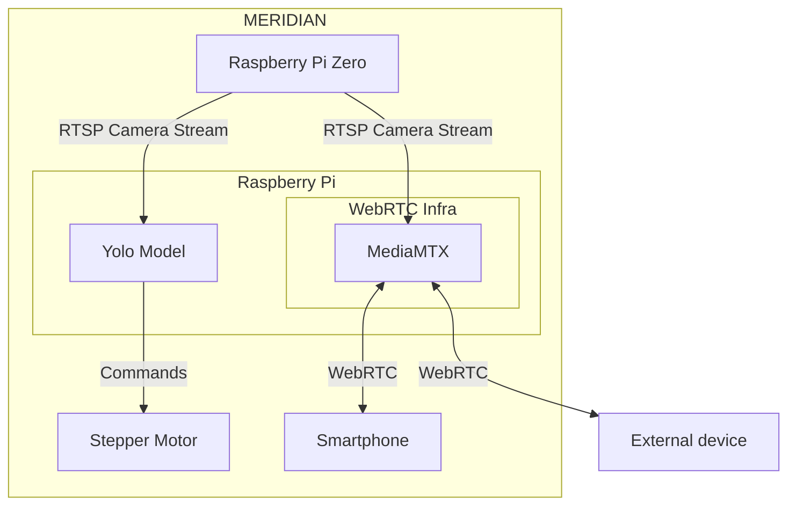

# MERIDIAN
Monorepo for all relevant MERIDIAN source code. 

## Install
For now both devices must be on the same network (hotspot is ideal)

To set up the MediaMTX server (do this on the host)
```bash
cd MERIDIAN-infra
docker compose up -d
```

In MERIDIAN-web make sure to cp `.env.example` to `.env` and change the address to the host's ip address (no port)
```bash
cd MERIDIAN-web
pnpm install
pnpm dev
```

Inspect element for any issues. Some privacy settings on browsers can interfere.

## Service Architecture


```mermaid
flowchart TD
subgraph MERIDIAN
    subgraph Raspberry Pi
        subgraph WebRTC Infra 
            MM["MediaMTX"]
        end
        ym["Yolo Model"]
    end
    rpi0["Raspberry Pi Zero"]
    m["Stepper Motor"]
    sm["Smartphone"]
end
ed["External device"]

ym -- "Commands" --> m
rpi0 -- "RTSP Camera Stream" --> ym
rpi0 -- "RTSP Camera Stream" --> MM
MM <-- "WebRTC" --> ed
MM <-- "WebRTC" --> sm
```