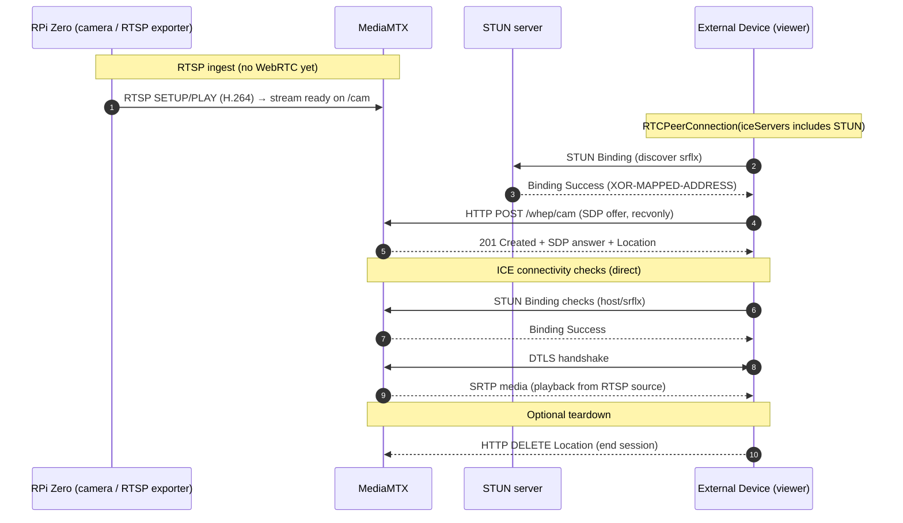

# MERIDIAN
Monorepo for all relevant MERIDIAN source code. 

## Service Architecture

## WebRTC Network Architecture
### Case 1: MERIDIAN broadcasts video
**STUN**:

**TURN**:

### Case 2: MERIDIAN receives video
**STUN**:

**TURN**:
